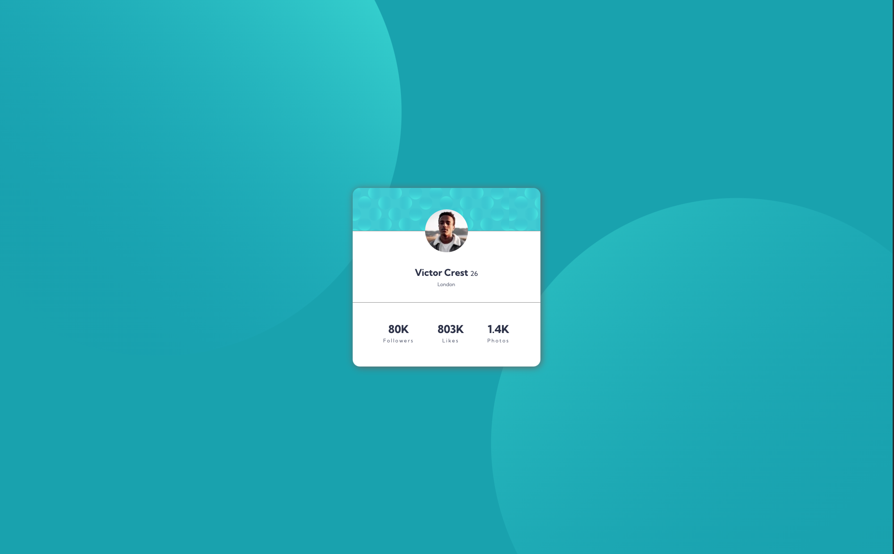
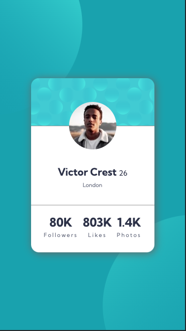

# Frontend Mentor - Profile card component solution

This is a solution to the [Profile card component challenge on Frontend Mentor](https://www.frontendmentor.io/challenges/profile-card-component-cfArpWshJ). Frontend Mentor challenges help you improve your coding skills by building realistic projects. 

## Table of contents
- [The challenge](#the-challenge)
- [Screenshot](#screenshot)
 - [Links](#links)
- [Built with](#built-with)
- [What I learned](#what-i-learned)

## Overview

### The challenge

Users should be able to:

- Build out the projects to the designed provided

### Screenshot

  
Desktop view  

  
Mobile view  

### Links

- Live Site URL: [Github pages](https://cyyong95.github.io/newbie/profile-card-component/)

## My process

### Built with

- Flexbox
- Mobile-first workflow
- Sass

### What I learned
- Sass
  - Finding that a css preprocessor really keeps the css clean
  - Variables reminds me of CSS variables or variables like any other programming language
  - Nesting functionality makes it quite easy to read the CSS and html structure  

- Background-image properties
  - Found out that we can add multiple background image
  - There are a few shorthand for the `background-position` property that can be used  

- Using `(r)ems` and `vmin` and `vmax`
  - Tried to mostly use these properties instead of `px` to scale the element properly
  - `rem` is just means root `em` and the value will be same as `font-size` set on `html` element
  - `em` applied on `font` is based on parent element size
  - `em` applied on other properties are affected by current element font size 
  