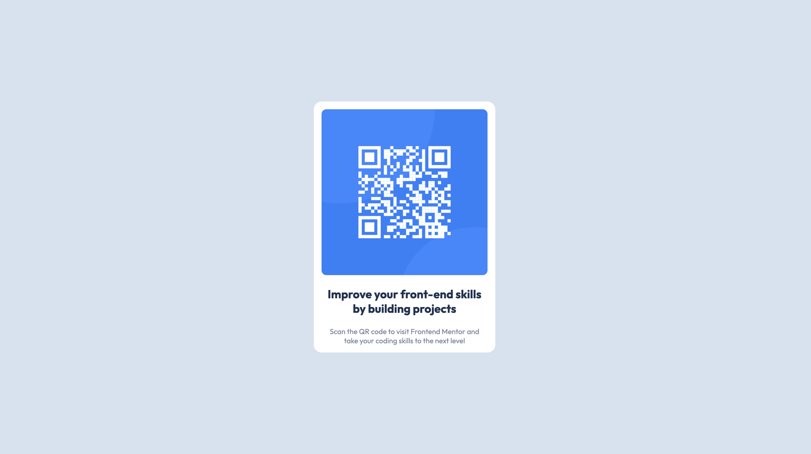

# Frontend Mentor - QR code component solution

This is a solution to the [QR code component challenge on Frontend Mentor](https://www.frontendmentor.io/challenges/qr-code-component-iux_sIO_H). Frontend Mentor challenges help you improve your coding skills by building realistic projects. 

## Table of contents

- [Screenshot](#screenshot)
 - [Links](#links)
- [Built with](#built-with)
- [What I learned](#what-i-learned)

## Overview

### Screenshot
  
Desktop view

  
Mobile view

### Links

- Solution URL: [Add solution URL here](https://your-solution-url.com)
- Live Site URL: [Github pages](https://cyyong95.github.io/newbie/qr-code-component/)

### Built with
- HTML
- CSS

### What I learned
- Flexbox  
  - Managed to learn the `flex-direction` property
  - Found out that centering a div is super easy using flexbox
- CSS Variables
  - Declaring values as variables promote reusability
  - Reduce chances of typing in the wrong value for properties
- Media Query
  - `min-width` on media query means that the screen size must reach certain minimum width before the css declared in media query will work
  - `max-width` on media query means that if the screen size doesn't go above the max width, the css declared in the media query will work